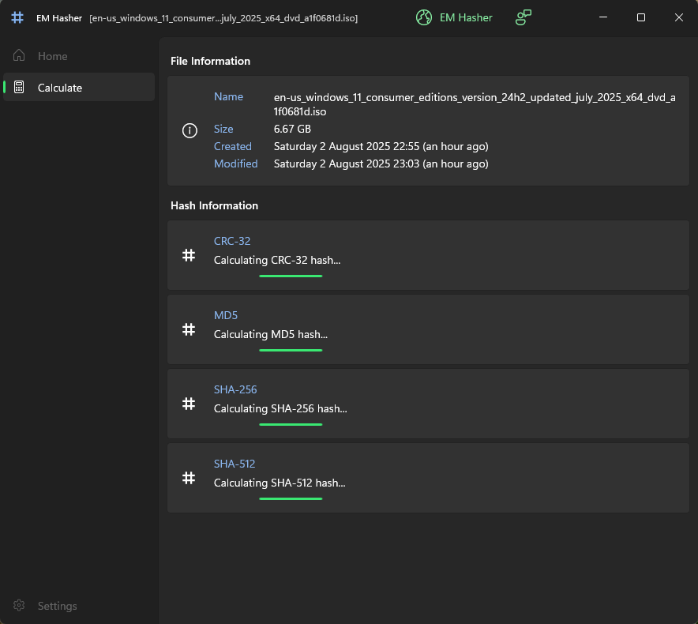
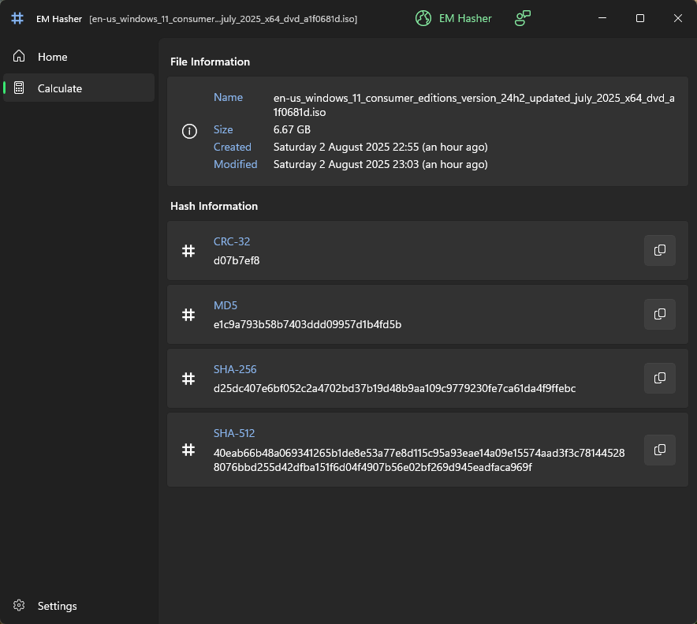

  

<h1 align="center">
  EM Hasher
</h1>

  Quickly calculate CRC-32/MD5/SHA-256/SHA-512 checksums in Windows 11

  

## Overview

EM Hasher is a modern hash-generating application built from the ground up for Windows 11. Native and fast (AOT) X64|ARM64. Quickly and easily calculate file hashes directly in Windows Explorer or on your Desktop. Choose your preferred hashing algorithms, including CRC-32/MD5/SHA-256/SHA-512. What would you like to see next?

 

#### Screenshots

  

  

 

## Release history

### 08/May/2025
v1.1.47 - First release. Enjoy! - Native (AOT) compiled app, targeting X64 and ARM64.

### 13/May/2025
v1.1.48 - Performance release! Managed to squeeze out a 50% perf improvement in some cases.

### 16/May/2025
v1.1.49 - Added SHA-512 hashing.

### 05/Jun/2025
v1.1.53 - Improvements and bug fixs!

### 09/Jun/2025
v1.1.54 - Added CRC-32 hashing.

### 23/Jun/2025 ###
v1.1.55 - Unlimited trial (with some features restricted).

### 10/Jul/2025 ###
v1.1.56 - Added 'Copy hash to clipboard' button.

### 22/Jul/2025 ###
v1.1.57 - UI improvements.

### 04/Aug/2025 ###
v1.1.58 - Now free & unrestricted. Enjoy :-)

### 08/Sep/2025 ###
v1.1.59 - Added third party license notices -> About section.

